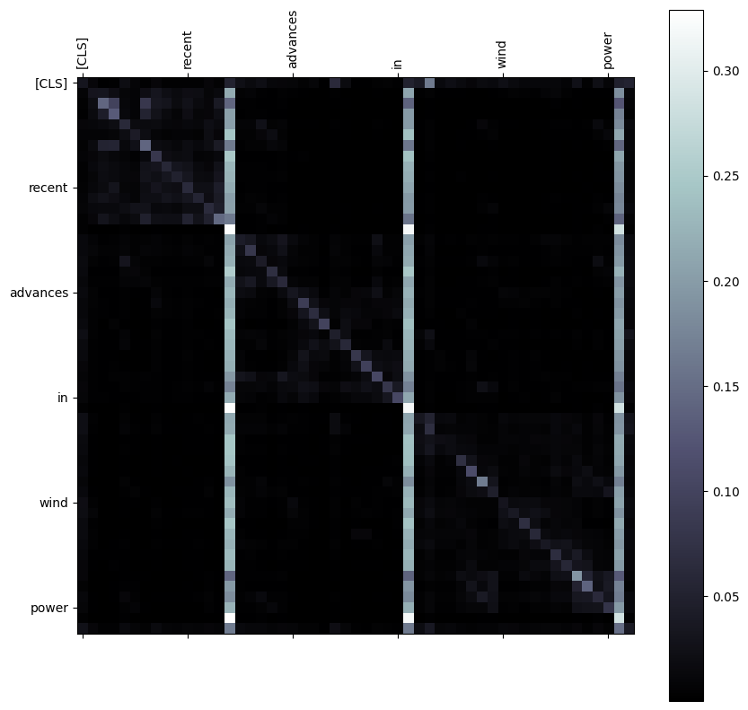

# Wind Power Forecasting with Transfer Learning

## **1. Overview**

This code folder supports the research project _Advancing Wind Power Forecasting Using Transfer Learning_. The project aims to enhance the accuracy of wind power predictions across regions by leveraging a transfer learning approach. The workflow includes preprocessing meteorological datasets, training an LSTM model on feature-rich Chinese data, and fine-tuning the model on U.S. data for cross-regional generalization.

---

## **2. Files Included**

| **File Name**         | **Description**                                                                 |
|------------------------|---------------------------------------------------------------------------------|
| `pre.py`              | Preprocesses raw data files, including normalization and sliding window creation.|
| `main.py`             | Implements model training, transfer learning, and evaluation scripts.            |
| `china_jan_2020.csv`  | Preprocessed Chinese dataset (January 2020) with meteorological and power data.  |
| `us_jan_2020.csv`     | Preprocessed U.S. dataset (January 2020) with aggregated wind power data.        |
| `README.md`           | Documentation for using the code folder.                                        |

---

## **3. Prerequisites**

### **Required Libraries**
- Python 3.9+
- TensorFlow 2.8+
- NumPy 1.21+
- Pandas 1.3+
- Matplotlib 3.4+

### **Installation Instructions**
1. Clone the repository:
   ```bash
   git clone git@github.com:ClAy140/STATS201-DKU-Fall2024.git
   cd wind-power-forecasting
   ```
2. Install required libraries:
   ```bash
   pip install -r requirements.txt
   ```

---

## **4. Usage Instructions**

### **Step 1: Preprocess Data**
Prepare the raw datasets for training and evaluation:
```bash
python pre.py
```
- This script normalizes raw meteorological data and creates sliding window input-output pairs.
- Outputs preprocessed `.csv` files (`china_jan_2020.csv` and `us_jan_2020.csv`).

### **Step 2: Train and Fine-Tune Models**
Run the main script to train the LSTM model on the Chinese dataset, transfer learned weights, and fine-tune on the U.S. dataset:
```bash
python main.py
```
- **Key Outputs:**
  - Trained models for China and the U.S.
  - Predictions and evaluation metrics (RMSE, MAE, R²).

### **Step 3: Visualize Results**
Analyze the model’s performance with prediction plots and attention heatmaps:
- Prediction Plots: Compare actual vs. predicted wind power values.
- Heatmaps: Visualize attention weights to interpret feature importance.

---

## **5. Expected Outputs**

### **Performance Metrics**
- **Root Mean Squared Error (RMSE):** Measures overall prediction accuracy.
- **Mean Absolute Error (MAE):** Quantifies the magnitude of errors.
- **R² Score:** Assesses the model's fit to actual data.

### **Visualizations**
- **Prediction Plots:** Graphs showing actual vs. predicted power outputs for both datasets.
- **Attention Heatmaps:** Highlight which features the model prioritizes during predictions.  
  Example:  
  

---

## **6. Contributors**

- **[Peng Wang]:** Lead researcher and developer.

