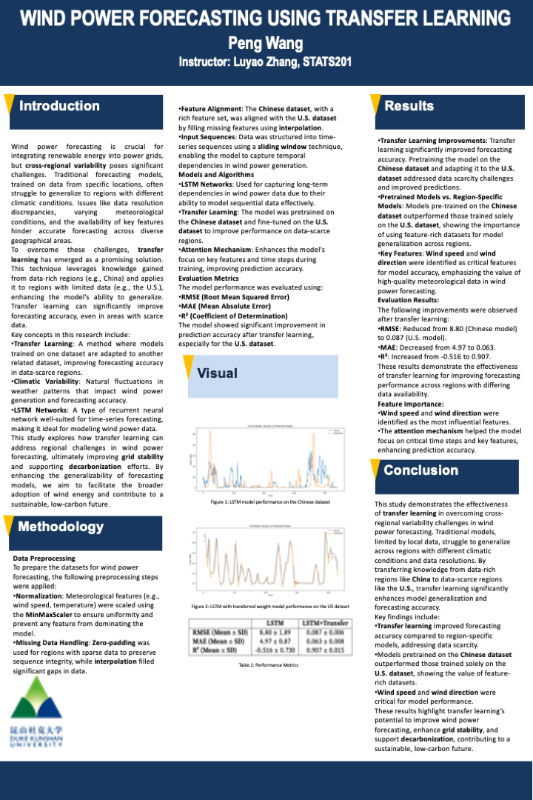

# Improving Wind Power Forecasting with LSTM-Based Transfer Learning across Feature-Rich and Feature-Poor Datasets

## Authors  
- **Peng Wang**: Project Lead, Model Development  


## Disclaimer  
This project was submitted for **STATS201: Machine Learning for Social Science**, instructed by **Prof. Luyao Zhang** at **Duke Kunshan University** in **Autumn 2024**.

---

## Table of Contents  

- [Overview](#overview)  
- [Key Concepts](#key-concepts)  
- [Project Structure](#project-structure)  
- [Requirements](#requirements)  
- [Setup](#setup)  
- [Evaluation](#evaluation)  
- [Conclusion](#conclusion)  
- [Acknowledgments](#acknowledgments)  
- [Statement of Intellectual and Professional Growth](#statement-of-intellectual-and-professional-growth)  
- [License](#license)  

---

## Overview  

This project investigates how **Transfer Learning (TL)** can improve **wind power forecasting** across regions with different data characteristics. Conventional forecasting models struggle to generalize due to climatic variability, data resolution differences, and the availability of meteorological features.  
Our solution trains a **Long Short-Term Memory (LSTM)** model on data from a **feature-rich region (China)** and transfers the learned knowledge to improve predictions in a **feature-poor region (U.S.)**.  

### **Key Achievements**  
- Enhanced accuracy in forecasting for **data-scarce regions**.  
- Demonstrated the value of **transfer learning** for renewable energy applications.  
- Supported improved **grid stability** and **decarbonization efforts**.  

---

## Key Concepts  

### Transfer Learning  
Applies knowledge from a data-rich region (**China**) to enhance forecasting in a data-scarce region (**U.S.**).  

### Climatic Variability  
The effects of regional weather differences (e.g., wind speed, temperature) on model generalizability.  

### LSTM Networks  
A **Recurrent Neural Network (RNN)** that captures long-term dependencies in **time-series forecasting**.  

---

## Project Structure  

### Code Directory  
The main scripts and relevant files are organized under the `Code/` directory:  
- **`Explanation.py`**: Architecture and methodology overview.  
- **`glance.py`**: Data insights and visualization functions.  
- **`main.py`**: Executes the transfer learning model.  
- **`pre.py`**: Preprocesses datasets for training.  
- **`predict_china.py`**: Makes predictions using the China dataset.  
- **`output_plots/`**: Stores plots (heatmaps, generation patterns, etc.).  

### Data Directory  
- **Raw Data**: `china_jan_2020.csv`, `us_jan_2020.csv`.  
- **Preprocessed Data**: `.pkl` files for both regions.  
- **Additional Files**: Wind plant capacity data, wind generation factors.  

### Supporting Documents  
- **`Explanation.ipynb`**: Step-by-step walkthrough in Jupyter Notebook.  
- **`Poster.pdf`**: Research findings and methodology.  
- **`installed_packages.txt`**: Dependency list.  
- **`system_configuration_report.txt`**: System and environment details.  

---

## Requirements  

Install the required packages using:  

```bash
pip install -r requirements.txt
```  

Alternatively, manually install:  
- `numpy`  
- `pandas`  
- `matplotlib`  
- `seaborn`  
- `scikit-learn`  
- `tensorflow`  

---

## Setup  

1. Clone this repository:  
   ```bash
   git clone https://github.com/yourusername/transfer-learning-wind-power.git
   ```  

2. Navigate to the `Code/` directory:  
   ```bash
   cd Code/
   ```  

3. Ensure datasets are placed in the `Data/` folder.  

4. Train the model:  
   ```bash
   python main.py
   ```  

5. View results in `output_plots/`.  

---

## Evaluation  

The forecasting model was evaluated using:  
- **Root Mean Squared Error (RMSE)**  
- **Mean Absolute Error (MAE)**  
- **R² (Coefficient of Determination)**  

---

## Embedded Media  

### Demo Video  
[](https://www.youtube.com/watch?v=DEMO_VIDEO_LINK)  

### Research Poster  
<p align="center">
    
</p>

*Figure 1: Poster of the Research Project. Created with PowerPoint*

---

## Conclusion  

By leveraging **Transfer Learning**, this project:  
- Improved wind power forecasting accuracy in the U.S.  
- Validated the feasibility of knowledge transfer from feature-rich datasets.  
- Supported advancements in renewable energy technology.  

---

## Acknowledgments  

Special thanks to:  
- **Prof. Luyao Zhang**, for insightful lectures and feedback.  
- **Classmates**, for collaborative discussions and peer reviews.  
- **AIGC tools (e.g., ChatGPT)**, for assistance in drafting and debugging code.  
- Open-source communities for providing datasets and libraries.  

---

## Statement of Intellectual and Professional Growth  

Through this project, we gained:  
1. **Technical Proficiency**: Mastery in transfer learning with LSTMs for time-series data.  
2. **Research Skills**: Experience in analyzing meteorological datasets and evaluating model performance.  
3. **Professional Development**: Insights into sustainable energy challenges and real-world applications of machine learning.  

This project solidified our understanding of machine learning frameworks and their potential to tackle global challenges.  

---

## License  

This project is licensed under the MIT License. See the [LICENSE](LICENSE) file for details.  
```

